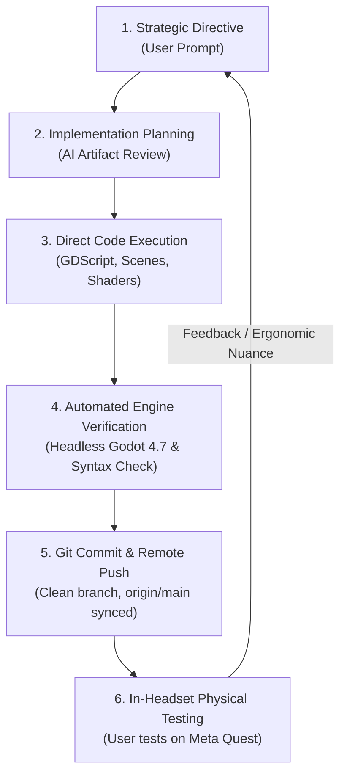

# Meta Scene XR Sample — Development Workflow & Project Standards

This document establishes the official development cycle, engineering standards, and collaboration workflow for the **Meta Scene XR Sample** (`feljohn07/meta-xr-room-scanner`) workspace. All AI pair-programming sessions in this project must adhere to this flow.

---

## 🧭 Project Context & Vision
* **Repository**: [feljohn07/meta-xr-room-scanner](https://github.com/feljohn07/meta-xr-room-scanner)
* **Target Hardware**: Meta Quest 2, Quest 3, Quest 3S, Quest Pro
* **Engine & Plugins**: Godot 4.3+ / 4.7 with `godotopenxrvendors` (Meta OpenXR Scene API, Spatial Anchors, Environment Depth Occlusion, Optical Hand Tracking)
* **Core Product Vision**: Transform real-world room scans into structured architectural data models (`user://room_scans/`) for **Space Reimagining**, virtual furniture placement, precision 3D tape measurement, and miniature CAD dollhouse inspection.

---

## 🔄 The 6-Stage Development Loop

Every feature, refactor, or bug fix follows this validated cycle:



### Stage 1: Strategic Intent & Scope Definition
* Understand the high-level product objective before touching code.
* Maintain a clear distinction between:
  * **Engine Core & Spatial Tracking** (`main.gd`, `OpenXRFbSceneManager`, `OpenXRFbSpatialAnchorManager`)
  * **Architectural Data Engine** (`room_data_manager.gd`, JSON persistence)
  * **XR Ergonomics & Controls** (Hand-anchored tablet, glance-activated wrist HUD, bare-hand pinch detector)
  * **Feature Subsystems** (Mini CAD viewer, 3D tape measure, item catalog spawner)

### Stage 2: Structured Implementation Planning
* For any non-trivial multi-file feature, write an **Implementation Plan Artifact** first (`implementation_plan.md`).
* Detail component architectures, data schemas, visual mockups, and open design decisions.
* Wait for user review and approval before proceeding with implementation.

### Stage 3: Multi-File Code Execution
* Implement changes across all relevant GDScript files, `.tscn` scene trees, and shaders in parallel.
* Preserve documentation integrity, existing comments, and docstrings.
* Use clean, strongly-typed GDScript with explicit return types and signal architectures.

### Stage 4: Automated Engine Verification (Strict Quality Gate)
* **Never commit untested code**. Always run local verification tools before staging:
  1. **GDScript Syntax Check**:
     ```powershell
     python verify_syntax.py
     ```
  2. **Godot 4.7 Engine Headless Import Check**:
     ```powershell
     Godot_v4.7.2-stable_win64_console.exe --headless --import
     ```
  3. Ensure 0 parse errors, 0 UID warnings, and clean resource dependencies.

### Stage 5: Atomic Git Commit & Remote Push
* Commit completed features with conventional commit messages (e.g., `feat: ...`, `fix: ...`, `docs: ...`).
* Keep the working tree clean and immediately push to `origin/main`:
  ```powershell
  git add -A && git commit -m "feat: <description>"
  git push origin main
  ```

### Stage 6: In-Headset Ergonomic Validation & Rapid Patching
* Meta XR development depends heavily on physical in-headset testing. When the user tests a build on Quest hardware and provides ergonomic or tracking feedback:
  * Prioritize immediate 5-to-15 minute patches.
  * Standard ergonomic rules established for this project:
    * **Glance-Angle Activation**: Vector dot product with $\ge 0.20$ hysteresis buffer to prevent jitter.
    * **Surface Snapping**: Add $+3\text{mm}$ offset along surface normals to prevent Z-fighting.
    * **Bare-Hand Pinches**: Use direct 3D Euclidean joint-distance calculations ($d \le 2.4\text{cm}$) rather than controller action emulation.
    * **UI Anchoring**: Handheld UI must anchor to the non-dominant controller/wrist ($18\text{cm}$ above, $12\text{cm}$ forward, tilted $-40^\circ$), never spawn in world space where it can clip into walls.

---

## 📚 Living Documentation Standard
* **`CHANGELOG.md`**: Updated with every released phase/version following Semantic Versioning.
* **`documentation/future implementation/`**: Detailed specifications and roadmaps for upcoming milestones.
* **`documentation/project_audit.md`**: Baseline technical audit, architectural reviews, and subsystem evaluations.
* **`documentation/README.md`**: Central documentation index linking all guides and references.
