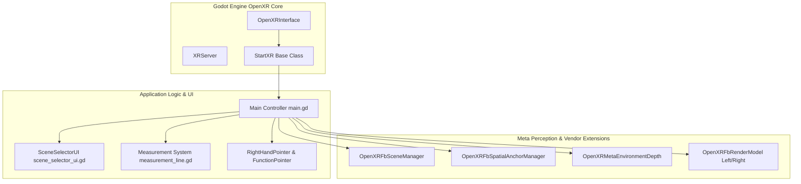
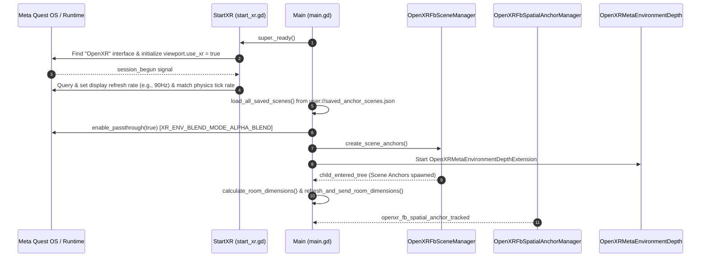

# Architecture Overview

This document details the architectural structure, node relationships, execution lifecycle, and core scripting patterns of the **Meta Scene XR Sample**.

---

## 1. High-Level Architecture

The project is architected around Godot's OpenXR implementation and the official **Godot OpenXR Vendors plugin**, specializing in Meta Quest hardware. 

The architecture is divided into three functional domains:
1. **XR Device & Tracking Pipeline**: Handles head pose tracking, hand controller tracking, Meta controller render models, and display refresh synchronization.
2. **Meta Perception Layer**: Interfaces directly with Meta OpenXR extensions for room mesh parsing, spatial entity anchors, passthrough blend modes, and real-time environment depth buffers.
3. **Application & User Interaction Domain**: Governs laser pointer interaction, spatial measurements, room bounding calculation, and the 2D-in-3D floating settings interface.



---

## 2. Scene Tree Hierarchy (`main.tscn`)

The main entry scene is defined in [`main.tscn`](file:///c:/Users/feljo/Desktop/Godot%20Projects%20XR/meta-scene-xr-sample/main.tscn), attached to [`main.gd`](file:///c:/Users/feljo/Desktop/Godot%20Projects%20XR/meta-scene-xr-sample/main.gd):

```text
Main (Node3D, script: main.gd [extends StartXR])
├── WorldEnvironment (WorldEnvironment)
├── DirectionalLight3D (DirectionalLight3D)
└── XROrigin3D (XROrigin3D)
    ├── XRCamera3D (XRCamera3D)
    │   └── OpenXRMetaEnvironmentDepth (OpenXRMetaEnvironmentDepth)
    ├── LeftHand (XRController3D, tracker: "left_hand", pose: "grip")
    │   ├── LeftControllerFbRenderModel (%LeftControllerFbRenderModel: OpenXRFbRenderModel)
    │   └── Label3D (Controls Help Text)
    ├── RightHand (XRController3D, tracker: "right_hand", pose: "grip")
    │   ├── RightControllerFbRenderModel (%RightControllerFbRenderModel: OpenXRFbRenderModel)
    │   ├── Label3D (Controls Help Text)
    │   └── DepthTestingMesh (MeshInstance3D, Box 0.1m³)
    ├── RightHandPointer (XRController3D, tracker: "right_hand")
    │   ├── FunctionPointer (instance: function_pointer.tscn)
    │   ├── ScenePointerMesh (MeshInstance3D, Cylinder/Box laser line)
    │   ├── SceneCollidingMesh (MeshInstance3D, Sphere target point)
    │   └── RayCast3D (target_position: Vector3(0, 0, -10), collision_mask: 6)
    ├── OpenXRFbSceneManager (OpenXRFbSceneManager)
    │   ├── default_scene: scene_anchor.tscn
    │   └── scenes/global_mesh: scene_global_mesh.tscn
    ├── OpenXRFbSpatialAnchorManager (OpenXRFbSpatialAnchorManager)
    │   └── scene: spatial_anchor.tscn
    └── SceneMenuViewport (%SceneMenuViewport, instance: viewport_2d_in_3d.tscn)
        └── [SubViewport] -> SceneSelectorUI (instance: scene_selector_ui.tscn)
```

---

## 3. Script Structure & Responsibilities

| Script | Inherits | Primary Purpose | Key Methods / Properties |
| :--- | :--- | :--- | :--- |
| [`main.gd`](file:///c:/Users/feljo/Desktop/Godot%20Projects%20XR/meta-scene-xr-sample/main.gd) | `StartXR` | Central controller for OpenXR events, anchor creation/deletion, persistence I/O, room bounds calculation, measurement dispatch, and controller input handling. | `_ready()`, `_physics_process()`, `calculate_room_dimensions()`, `switch_to_layout()`, `save_current_layout()`, `_on_right_hand_button_pressed()` |
| [`addons/common/start_xr.gd`](file:///c:/Users/feljo/Desktop/Godot%20Projects%20XR/meta-scene-xr-sample/addons/common/start_xr.gd) | `Node3D` | Standard OpenXR bootstrap based on official Godot XR best practices. Configures viewport XR, matches physics ticks to display refresh rates (e.g., 72/90/120 Hz), and handles focus/pause states. | `_ready()`, `_on_openxr_session_begun()`, `_on_openxr_focused_state()` |
| [`scene_selector_ui.gd`](file:///c:/Users/feljo/Desktop/Godot%20Projects%20XR/meta-scene-xr-sample/scene_selector_ui.gd) | `Control` | 2D control panel rendered in 3D space. Provides tab navigation between **Layouts** and **Measurements**, room dimension metric/imperial readouts, and layout save/switch controls. | `set_scenes_data()`, `set_room_dimensions()`, `set_tape_measure_state()`, `_switch_tab()` |
| [`scene_anchor.gd`](file:///c:/Users/feljo/Desktop/Godot%20Projects%20XR/meta-scene-xr-sample/scene_anchor.gd) | `Node3D` | Instantiated dynamically by `OpenXRFbSceneManager` for detected room surfaces (walls, floor, ceiling, couch, table, etc.). Builds collision shapes and semantic text labels. | `setup_scene(entity)`, `_get_color_for_label()` |
| [`scene_global_mesh.gd`](file:///c:/Users/feljo/Desktop/Godot%20Projects%20XR/meta-scene-xr-sample/scene_global_mesh.gd) | `Node3D` | Instantiated dynamically for the overall room wireframe mesh. Reconstructs triangle arrays with unique vertices to enable custom wireframe rendering. | `setup_scene(entity)` |
| [`spatial_anchor.gd`](file:///c:/Users/feljo/Desktop/Godot%20Projects%20XR/meta-scene-xr-sample/spatial_anchor.gd) | `Area3D` | Individual user-placed spatial anchor in the world. Displays a color-coded cube, handles selection highlights, and synchronizes to local/cloud storage. | `setup_scene(spatial_entity)`, `set_selected()` |
| [`measurement_line.gd`](file:///c:/Users/feljo/Desktop/Godot%20Projects%20XR/meta-scene-xr-sample/measurement_line.gd) | `Node3D` | Represents a 3D measurement vector in space. Connects Point A to Point B with a dynamic cylinder mesh, terminal spheres, and an orientation-billboarded label displaying total distance and axis deltas. | `update_points(p_a, p_b, use_imperial)` |

---

## 4. Execution & Initialization Lifecycle



1. **Bootstrapping**: `StartXR._ready()` initializes `XRServer.find_interface("OpenXR")`, activates `vp.use_xr = true`, and sets up OpenXR lifecycle signals.
2. **Session Start**: When `session_begun` fires, `main.gd` executes:
   - Reads `user://saved_anchor_scenes.json` to load the active scene layout.
   - Activates passthrough by setting `xr_interface.environment_blend_mode = XR_ENV_BLEND_MODE_ALPHA_BLEND` and `vp.transparent_bg = true`.
   - Calls `scene_manager.create_scene_anchors()` to spawn physical scene entities from Meta Space Setup.
   - Starts the `OpenXRMetaEnvironmentDepthExtension` if supported by hardware.
3. **Anchor Restoration**: Stored UUIDs for the active layout are dispatched to `spatial_anchor_manager.load_anchors(..., STORAGE_LOCAL, true)`.
4. **Dimension Analysis**: As scene anchors enter the tree, an asynchronous timer triggers `calculate_room_dimensions()` to populate UI data.

---

## 5. Collision Layer Matrix

The project strictly partitions physics interactions via Godot 3D collision layers:

| Layer ID | Name | Assigned Objects | Interacting Query Nodes |
| :--- | :--- | :--- | :--- |
| **Layer 1** | `Virtual Environment` | Generic virtual objects, menus, and testing geometry. | General physics queries. |
| **Layer 2** | `Scene Understanding` | Real-world furniture, walls, floor, and ceiling generated by `OpenXRFbSceneManager`. | `RightHandPointer/RayCast3D` (Mask bit 2). |
| **Layer 3** | `Spatial Anchors` | User-placed spatial anchor nodes (`Area3D` in `spatial_anchor.tscn`). | `RightHandPointer/RayCast3D` (Mask bit 3). |

*Note: The pointer raycast has `collision_mask = 6` (binary `0110`), allowing it to exclusively detect Layer 2 (Scene Understanding surfaces) and Layer 3 (Spatial Anchors).*
