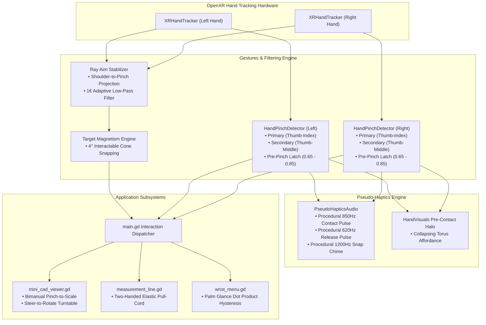

# Step 3: Advanced Hand Tracking Gestures & Ergonomics Specification

## 🧭 Executive Summary & Industry Background

When transitioning an XR application from 6-DOF physical controllers to bare-hand optical tracking, developers often make the mistake of directly emulating controller buttons with mid-air taps. This creates an experience fraught with accidental clicks, arm fatigue, tracking jitter, and a complete lack of tactile response.

Modern spatial operating systems—such as **Meta Horizon OS** (via the Meta Interaction SDK), **Apple visionOS**, **Microsoft MRTK3**, and **Ultraleap (Gemini)**—have spent years codifying human interface guidelines (HIG) specifically tailored to bare hands.

This specification details the architecture, mathematical formulations, and engineering designs required to implement a state-of-the-art hand tracking gesture system for the **Meta Scene XR Sample** (`feljohn07/meta-xr-room-scanner`) workspace.

---

## 🛑 The Four Fundamental Pitfalls of Bare-Hand XR

```
┌─────────────────────────────────────────────────────────────────────────────┐
│                       THE 4 BARE-HAND TRACKING TRAPS                        │
├───────────────────────────────┬─────────────────────────────────────────────┤
│ 1. The Heisenberg Effect      │ Pinching fingers together mechanically      │
│                               │ rotates the hand by 5–15mm, deflecting the  │
│                               │ distant selection ray by 30cm+ at 3 meters. │
├───────────────────────────────┼─────────────────────────────────────────────┤
│ 2. The Sensory Void           │ No vibration motors or physical buttons;   │
│                               │ users cannot perceive when a click occurs. │
├───────────────────────────────┼─────────────────────────────────────────────┤
│ 3. Spatial Control Deficit    │ Controllers have analog sticks and 8 buttons;│
│                               │ bare hands have only pinch and open palm.  │
├───────────────────────────────┼─────────────────────────────────────────────┤
│ 4. Gorilla Arm Fatigue        │ Holding hands suspended in mid-air quickly  │
│                               │ fatigues shoulder and trapezius muscles.    │
└───────────────────────────────┴─────────────────────────────────────────────┘
```

---

## 📐 System Architecture



---

## 🛠️ Feature Subsystems & Mathematical Models

### 1. Anti-Heisenberg Pre-Pinch Ray Latching
In controllers, users squeeze an index trigger while maintaining a solid grip on the controller body. With optical tracking, moving the thumb to meet the index finger alters the hand's center of mass and wrist angle.

#### The Latch State Machine
Instead of a single binary click threshold, tracking uses three distinct physiological zones:

```
Pinch Strength:  0.0 ────────── 0.65 ────────────── 0.85 ────────── 1.0
Joint Distance:  60mm ───────── 28mm ────────────── 22mm ────────── 15mm
                 [  HOVER ZONE  ] [  LATCH ZONE   ] [  CONTACT ZONE ]
                 Raycast moves    Raycast FROZEN    Trigger Action Fires
                 freely           Target locked     Pseudo-haptic audio
```

* **Hover Zone ($d > 28\text{ mm}$, $\text{strength} < 0.65$)**: Normal raycasting.
* **Latch Zone ($22\text{ mm} < d \le 28\text{ mm}$, $0.65 \le \text{strength} < 0.85$)**:
  * The raycast intersection coordinate $\mathbf{p}_{\text{hit}}$ and hovered collider are **latched (frozen)**.
  * Micro-movements of the hand while squeezing fingers together cannot knock the reticle off the target.
* **Contact Zone ($d \le 22\text{ mm}$, $\text{strength} \ge 0.85$)**:
  * Emits `pinch_tapped`. Executes the interaction on the latched target.
  * Plays high-frequency tactile audio transient ($850\text{ Hz}$).
* **Release Zone ($d \ge 38\text{ mm}$, $\text{strength} \le 0.40$)**:
  * Emits `pinch_released`. Releases grab or unlatches aim.

---

### 2. Procedural Acoustic Pseudo-Haptics
Because optical hand tracking does not provide physical vibration, audio must serve as the primary sensory substitute. To ensure zero asset dependencies, a procedural audio synthesizer node (`PseudoHapticsAudio`) generates low-latency audio waveforms using Godot's `AudioStreamGenerator`.

#### Acoustic Specifications
| Event | Frequency ($f$) | Duration ($t$) | Waveform | Psychoacoustic Purpose |
| :--- | :--- | :--- | :--- | :--- |
| **Pinch Contact** | $850\text{ Hz}$ | $12\text{ ms}$ | Sine + Exp Decay | Mimics sharp physical micro-switch click. |
| **Pinch Release** | $620\text{ Hz}$ | $10\text{ ms}$ | Sine + Exp Decay | Confirms finger separation and release. |
| **Target Magnet Snap** | $1200\text{ Hz} \to 1600\text{ Hz}$ | $8\text{ ms}$ | Frequency Chirp | Confirms reticle lock onto an interactable. |
| **Direct Poke Bottom-Out** | $320\text{ Hz}$ | $18\text{ ms}$ | Triangle Pulse | Simulates soft material impact. |

#### Synthesis Formula
$$y(t) = A \cdot \sin(2\pi f t) \cdot e^{-\lambda t}$$
Where $\lambda = \frac{4.0}{t_{\text{duration}}}$, ensuring smooth decay to zero without audible clipping artifacts.

---

### 3. Bimanual (Two-Handed) Pinch-to-Scale & Steer
For 3D models like the **Mini CAD Dollhouse** (`mini_cad_viewer.gd`), zooming and rotating using menus or single-handed raycasts feels clunky. Bimanual manipulation mirrors real-world physical inspection.

#### Kinematics Formulation
1. **Activation**: Both hands pinch simultaneously within $0.40\text{ m}$ proximity of the CAD workstation.
2. **Initial State Capture**:
   $$\mathbf{v}_0 = \mathbf{p}_{\text{right}}(t_0) - \mathbf{p}_{\text{left}}(t_0)$$
   $$d_0 = \|\mathbf{v}_0\|$$
   $$\theta_0 = \text{atan2}(v_{0.x}, v_{0.z})$$
3. **Continuous Transformation ($t > t_0$)**:
   * **Scale Factor**:
     $$s(t) = s_{\text{base}} \cdot \frac{\|\mathbf{p}_{\text{right}}(t) - \mathbf{p}_{\text{left}}(t)\|}{d_0}$$
     Clamped between architectural limits: $s \in [0.01, 0.10]$ ($1:100$ to $1:10$).
   * **Steering Yaw Rotation**:
     $$\Delta \theta = \text{atan2}(v_{t.x}, v_{t.z}) - \theta_0$$
     The dollhouse turntable rotates by $\Delta \theta$ around the vertical world Y axis.

---

### 4. Two-Handed Elastic "Pull-Cord" 3D Tape Measure
Instead of two sequential clicks, the two-handed elastic tape measure provides an intuitive spatial construction tool:

```
Non-Dominant Hand (Anchor)             Dominant Hand (Pull-Cord)
        (•)═══════════════════════════════════════>(•)
     [Point A]          Live Dynamic Dimension       [Point B]
   Pinch & Hold          Preview Ribbon Line        Pinch & Pull
```

1. **Point A (Anchor)**: User pinches non-dominant thumb and index finger at a surface or corner. Point A locks to that fingertip in 3D world space.
2. **Point B (Pull-Cord)**: User pinches dominant hand and pulls outward. A glowing preview measurement cylinder stretches dynamically between the two pinch points.
3. **Commit**: Releasing the dominant hand pinch commits Point B and leaves the permanent measurement line pinned in the room.

---

### 5. Secondary Pinch Gesture Chord (Thumb + Middle Finger)
To make up for the lack of controller buttons (`[A]`, `[B]`, `[X]`, `[Y]`), `HandPinchDetector` is extended to monitor the middle finger tip (`HAND_JOINT_MIDDLE_FINGER_TIP`) relative to the thumb tip:

$$\text{dist}_{\text{sec}} = \|\mathbf{p}_{\text{thumb\_tip}} - \mathbf{p}_{\text{middle\_tip}}\|$$

* **Primary Pinch (Index + Thumb)**: Universal Select / Place / Drag / Trigger.
* **Secondary Pinch (Middle + Thumb)**:
  * **Hovering over a Spatial Anchor**: Instant Delete without opening a menu.
  * **Hovering in World Space**: Instant color palette cycle for upcoming anchors.
  * **In CAD Dollhouse Mode**: Instant turntable orientation reset.

---

### 6. Palm-Up Glance HUD Stabilization
The wrist menu is upgraded from pure wrist orientation to palm normal dot-product tracking with angular hysteresis:

$$\mathbf{n}_{\text{palm}} = \text{basis.y of } \text{HAND_JOINT_PALM}$$
$$\mathbf{v}_{\text{to\_head}} = \frac{\mathbf{p}_{\text{camera}} - \mathbf{p}_{\text{palm}}}{\|\mathbf{p}_{\text{camera}} - \mathbf{p}_{\text{palm}}\|}$$
$$\text{dot}_{\text{glance}} = \mathbf{n}_{\text{palm}} \cdot \mathbf{v}_{\text{to\_head}}$$

* **Activation Threshold**: $\text{dot}_{\text{glance}} \ge 0.40$ (User brings open palm up facing their face).
* **Deactivation Threshold**: $\text{dot}_{\text{glance}} \le 0.22$ ($0.18$ hysteresis buffer to prevent menu flicker).
* **Spring Smoothing**: The menu is anchored to a smoothed spring-damper transform rather than a rigid joint parent, isolating the UI panel from natural finger twitching.

---

## 📊 Controller vs. Hand Tracking Parity Matrix

| Functionality | Physical Controller | Optical Hand Equivalent | Ergonomic Benefit |
| :--- | :--- | :--- | :--- |
| **Select / Commit** | `trigger_click` | Index Pinch with Pre-Pinch Latch | 0% aim drift; passive self-haptic touch |
| **Direct UI Tap** | Controller mesh collision | Index Fingertip Poke | Natural physical push with acoustic bottom-out |
| **Summon Main Hub** | Left `[Menu]` Button | Glance at Non-Dominant Palm | Zero clutter; never clips into distant geometry |
| **Delete / Secondary** | Contextual Button | Secondary Pinch (Thumb-Middle) | Instant action without navigating nested UI |
| **Scale CAD Model** | Grip + Thumbstick | Bimanual Pinch-and-Spread | Natural 1:1 physical stretch metaphor |
| **Rotate CAD Model** | Thumbstick horizontal | Bimanual Steering Wheel | Continuous kinematic control |
| **3D Tape Measure** | Two sequential ray clicks | Two-Handed Elastic Pull-Cord | Mirrors real physical tape measure |
| **Tactile Confirmation** | Hardware LRA Rumble | Procedural Acoustic Transients | Replaces haptics with $< 15\text{ms}$ audio cues |

---

## 🧪 Verification & Acceptance Criteria

1. **Parse & Syntax Validation**:
   ```powershell
   python verify_syntax.py
   ```
   Must output `All files passed syntax validation!`.

2. **Headless Engine Import**:
   ```powershell
   Godot_v4.7.2-stable_win64_console.exe --headless --import
   ```
   Must load all scenes with 0 script compile errors and 0 missing resource dependencies.

3. **In-Headset Ergonomic Pass (Meta Quest)**:
   * **Anti-Heisenberg Verification**: Rapidly pinch a distant $2\text{cm}$ UI button 10 times from $2.5\text{m}$ distance; success rate must be $\ge 90\%$.
   * **Latency Verification**: Audio click transients must fire synchronously with finger physical touch.
   * **Bimanual Scalability**: Two-handed scale on CAD model must remain smooth with no gimbal lock or sudden jumps when hands cross.
