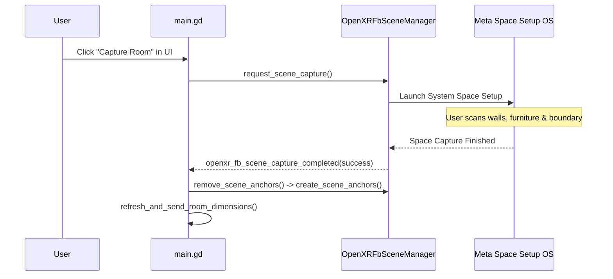
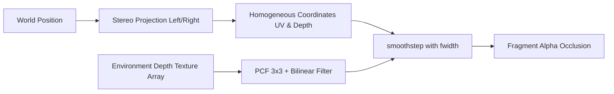

# Meta XR Features Deep Dive

This document details the Meta OpenXR vendor extensions implemented in the project via the **Godot OpenXR Vendors plugin** (`godotopenxrvendors`).

---

## 1. Passthrough & Environment Blending

### Overview
Meta Quest Passthrough provides real-time stereo video feed of the user's physical environment. In Godot, passthrough is controlled via OpenXR Environment Blend Modes rather than camera textures.

### Implementation Architecture
In [`main.gd`](file:///c:/Users/feljo/Desktop/Godot%20Projects%20XR/meta-scene-xr-sample/main.gd):
```gdscript
func enable_passthrough(enable: bool) -> void:
    if passthrough_enabled == enable:
        return

    var supported_blend_modes = xr_interface.get_supported_environment_blend_modes()
    if XRInterface.XR_ENV_BLEND_MODE_ALPHA_BLEND in supported_blend_modes and XRInterface.XR_ENV_BLEND_MODE_OPAQUE in supported_blend_modes:
        if enable:
            # Switch to passthrough mode
            xr_interface.environment_blend_mode = XRInterface.XR_ENV_BLEND_MODE_ALPHA_BLEND
            get_viewport().transparent_bg = true
            world_environment.environment.background_color = Color(0.0, 0.0, 0.0, 0.0)
        else:
            # Switch back to full VR mode
            xr_interface.environment_blend_mode = XRInterface.XR_ENV_BLEND_MODE_OPAQUE
            get_viewport().transparent_bg = false
            world_environment.environment.background_color = Color(0.3, 0.3, 0.3, 1.0)
        passthrough_enabled = enable
```

### Key Technical Requirements
1. **Viewport Transparency**: `get_viewport().transparent_bg = true` ensures the root framebuffer has an alpha channel that the compositor blends with the camera feed.
2. **Clear Color Alpha**: `world_environment.environment.background_color` must be set to `(0, 0, 0, 0)`. Any opaque background clears the passthrough feed.
3. **Android Export Setting**: In `export_presets.cfg`, `meta_xr_features/passthrough = 2` (Required) must be configured.

---

## 2. Meta Scene Understanding API

The Scene Understanding API grants access to the user's physical room layout, parsed into semantic geometric entities.

### Node Architecture
- **Manager Node**: `OpenXRFbSceneManager` (child of `XROrigin3D`)
- **Default Surface Scene**: [`scene_anchor.tscn`](file:///c:/Users/feljo/Desktop/Godot%20Projects%20XR/meta-scene-xr-sample/scene_anchor.tscn) (assigned to `default_scene`)
- **Global Mesh Scene**: [`scene_global_mesh.tscn`](file:///c:/Users/feljo/Desktop/Godot%20Projects%20XR/meta-scene-xr-sample/scene_global_mesh.tscn) (assigned to `scenes/global_mesh`)

### Lifecycle & Scene Capture


When no scene data exists in Quest memory, the signal `openxr_fb_scene_data_missing` is fired automatically, invoking `scene_manager.request_scene_capture()` to guide the user through Space Setup.

### Semantic Surface Classification
In [`scene_anchor.gd`](file:///c:/Users/feljo/Desktop/Godot%20Projects%20XR/meta-scene-xr-sample/scene_anchor.gd), when an entity is spawned, `setup_scene(entity)` extracts semantic classifications:

```gdscript
var semantic_labels: PackedStringArray = entity.get_semantic_labels()
var collision_shape = entity.create_collision_shape()
if collision_shape:
    static_body.add_child(collision_shape)
mesh_instance = entity.create_mesh_instance()
```

#### Supported Semantic Labels & Visual Color-Coding:
| Semantic Category | Extracted Labels | Assigned Debug Color |
| :--- | :--- | :--- |
| **Boundaries** | `ceiling`, `floor` | Black (`#000000`) |
| **Walls** | `wall_face`, `invisible_wall_face` | Blue (`#0000FF`) |
| **Portals** | `window_frame`, `door_frame` | Red (`#FF0000`) |
| **Furniture** | `couch`, `table`, `bed`, `lamp`, `plant`, `screen`, `storage` | Green (`#00FF00`) |
| **Other / Unknown** | Any unmatched label | White (`#FFFFFF`) |

### Global Room Mesh Reconstruction
In [`scene_global_mesh.gd`](file:///c:/Users/feljo/Desktop/Godot%20Projects%20XR/meta-scene-xr-sample/scene_global_mesh.gd), the entire room's continuous triangular mesh is extracted. Because custom wireframe shaders require unique barycentric coordinates per vertex without indexed sharing:
1. `entity.get_triangle_mesh()` extracts raw vertex and index buffers.
2. The index buffer is unrolled into non-indexed contiguous vertices:
   ```gdscript
   var vertices := PackedVector3Array()
   vertices.resize(mesh_array[Mesh.ARRAY_INDEX].size())
   for i in range(mesh_array[Mesh.ARRAY_INDEX].size()):
       vertices[i] = mesh_array[Mesh.ARRAY_VERTEX][mesh_array[Mesh.ARRAY_INDEX][i]]
   mesh_array[Mesh.ARRAY_VERTEX] = vertices
   mesh_array[Mesh.ARRAY_INDEX] = null
   ```
3. A custom barycentric wireframe shader ([`assets/wireframe-material.gdshader`](file:///c:/Users/feljo/Desktop/Godot%20Projects%20XR/meta-scene-xr-sample/assets/wireframe-material.gdshader)) is applied, rendering crisp polygon outlines over real surfaces.

---

## 3. Meta Spatial Anchors API

Spatial Anchors allow positioning arbitrary virtual objects that stay precisely locked to physical world coordinates across reboots.

### Node Architecture
- **Manager**: `OpenXRFbSpatialAnchorManager` (child of `XROrigin3D`)
- **Anchor Representation**: [`spatial_anchor.tscn`](file:///c:/Users/feljo/Desktop/Godot%20Projects%20XR/meta-scene-xr-sample/spatial_anchor.tscn) (`Area3D`, collision layer 3)

### Anchor Placement Modes
1. **Surface Snapping Placement (Trigger Click on Collision)**:
   Raycasts against physical room surfaces (collision layer 2). Aligns the anchor's basis with the surface normal:
   - For horizontal surfaces (`Vector3.UP` / `Vector3.DOWN`), rotates 90° along the X-axis.
   - For vertical walls, uses `Basis.looking_at(collision_normal)`.
2. **Floating Placement (A Button Press)**:
   Creates an anchor floating in air at the right controller's current 3D transform.

### Persistence & Cloud Sync
In [`spatial_anchor.gd`](file:///c:/Users/feljo/Desktop/Godot%20Projects%20XR/meta-scene-xr-sample/spatial_anchor.gd):
```gdscript
spatial_entity.save_to_storage(OpenXRFbSpatialEntity.STORAGE_CLOUD)
```
Anchors are also saved to local storage (`STORAGE_LOCAL`) and indexed in the JSON layout manager (`user://saved_anchor_scenes.json`).

---

## 4. Environment Depth & Dynamic Occlusion

Environment Depth generates real-time per-pixel depth of the real world, allowing virtual content to be occluded by real objects, such as the user's physical hands or real furniture.

### Components
1. **Extension Singleton**: `OpenXRMetaEnvironmentDepthExtension`
   - Initialized via `environment_depth.start_environment_depth()`
   - Checks `is_environment_depth_supported()` and `is_hand_removal_supported()`
2. **Depth Camera Node**: `OpenXRMetaEnvironmentDepth` attached to `XRCamera3D`
3. **Global Shader Globals** (configured in `project.godot`):
   - `META_ENVIRONMENT_DEPTH_TEXTURE` (`sampler2DArray`)
   - `META_ENVIRONMENT_DEPTH_TEXEL_SIZE` (`vec2`)
   - `META_ENVIRONMENT_DEPTH_PROJECTION_VIEW_LEFT` / `RIGHT` (`mat4`)

### Occlusion Shader Architecture ([`environment_depth.gdshader`](file:///c:/Users/feljo/Desktop/Godot%20Projects%20XR/meta-scene-xr-sample/environment_depth.gdshader))



The shader supports three occlusion modes:
- `OCCLUSION_MODE 0`: Hard step comparison (`depth < camera_depth ? 0.0 : 1.0`).
- `OCCLUSION_MODE 1`: Soft occlusion via bilinear depth sampling and `smoothstep(-w, w, delta)` using `fwidth(delta)`.
- `OCCLUSION_MODE 2` (Default): High-quality **PCF 3x3 (Percentage-Closer Filtering)** sampling a 9-tap kernel weighted by Gaussian coefficients `[1, 2, 1]`, eliminating aliased jagged edges around hands and physical geometry.

---

## 5. Dynamic Controller Models (`OpenXRFbRenderModel`)

Instead of bundling static controller 3D meshes that become outdated across Meta Quest 2, 3, and Pro:
- Nodes `%LeftControllerFbRenderModel` and `%RightControllerFbRenderModel` use the `OpenXRFbRenderModel` node provided by the vendor plugin.
- Dynamically downloads the exact 3D controller model corresponding to the connected hardware.
- **Render Priority Optimization**:
  ```gdscript
  func _on_openxr_fb_render_model_loaded(render_model: OpenXRFbRenderModel) -> void:
      for mesh_instance in render_model.find_children("*", "MeshInstance3D", true, false):
          for i in range(mesh_instance.mesh.get_surface_count()):
              var material: Material = mesh_instance.mesh.surface_get_material(i)
              # Render priority -100 ensures hands/controllers render before
              # the depth buffer is evaluated for environment occlusion.
              material.render_priority = -100
  ```
