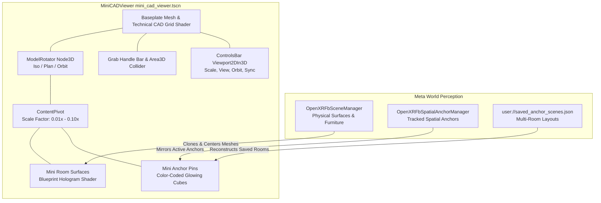

# Mini CAD / Dollhouse Prototype Viewer

The **Mini CAD Viewer** is an interactive mixed reality architectural workstation that projects a miniature AutoCAD-style blueprint representation of scanned rooms, physical furniture, and spatial anchors.

Users can freely reposition the workstation in their physical room (e.g., resting on a physical table or floating in mid-air), resize it across architectural scale ratios (1:10 to 1:100), switch between 3D isometric dollhouse and 2D floorplan views, and inspect saved room layouts.

---

## 1. System Architecture

---

## 2. Technical Blueprint Shaders

The CAD viewer employs two custom shaders to replicate high-end CAD / architectural drafting software aesthetics:

### A. Technical Blueprint Grid ([`assets/cad_blueprint_grid.gdshader`](file:///c:/Users/feljo/Desktop/Godot%20Projects%20XR/meta-scene-xr-sample/assets/cad_blueprint_grid.gdshader))
- **Dark Technical Baseplate**: Background tint in dark navy/slate (`#08101f`).
- **Dual-Tier Grid Lines**: Major grid lines every 0.1m in bright electric cyan (`#00e5ff`) with minor subdivisions in dark technical blue.
- **Cartesian Coordinate Axes**: Center origin $X$ (red) and $Z$ (green) axis highlighting.
- **Luminescent Border**: Outer glowing edge frame with subtle emission.

### B. Holographic Blueprint Surfaces ([`assets/cad_blueprint_surface.gdshader`](file:///c:/Users/feljo/Desktop/Godot%20Projects%20XR/meta-scene-xr-sample/assets/cad_blueprint_surface.gdshader))
- **Fresnel Edge Glow**: Accentuates architectural boundaries, wall edges, and furniture silhouettes based on camera view angle:
  $$F = (1.0 - \text{clamp}(\vec{N} \cdot \vec{V}, 0.0, 1.0))^{\text{power}}$$
- **Semantic Color Coding**:
  - **Walls**: Semi-transparent navy with vibrant cyan glowing edges.
  - **Floors & Ceilings**: Deep translucent slate backing with subtle blue perimeter highlights.
  - **Doors & Windows**: Architectural portal red with neon highlights.
  - **Furniture**: Emerald green wireframe and semi-transparent body.

---

## 3. Geometry Mirroring & Normalization

When constructing the mini CAD model (`rebuild_cad_model()`):
1. **Bounding Box Extrema**: The algorithm scans all physical surface nodes in `OpenXRFbSceneManager` to calculate the global bounding box $[X_{min}, X_{max}]$, $[Y_{min}, Y_{max}]$, $[Z_{min}, Z_{max}]$.
2. **Center Normalization**:
   $$\vec{P}_{center} = \left( \frac{X_{min} + X_{max}}{2}, Y_{min}, \frac{Z_{min} + Z_{max}}{2} \right)$$
   Every surface mesh and anchor is offset by $-\vec{P}_{center}$ so that the miniature model is perfectly centered on the baseplate grid with its floor resting flush on the CAD table.
3. **Scale Application**:
   The `ContentPivot` node scales uniformly:
   $$S_{pivot} = \vec{1} \times R_{scale}$$

---

## 4. Architectural Scale Presets & Resizing

The viewer supports 5 standard architectural scale presets, accessible via the `[➖ Scale]` and `[➕ Scale]` buttons or programmatic ratio settings:

| Preset Ratio | Multiplier ($R_{scale}$) | Description |
| :--- | :--- | :--- |
| **1:10** | `0.100x` | Large macro dollhouse view (1m in real life = 10cm on the CAD grid). |
| **1:20** | `0.050x` | Medium architectural scale for detailed furniture inspection. |
| **1:25** *(Default)* | `0.040x` | Optimal balance fitting typical residential rooms onto a 1.2m baseplate. |
| **1:50** | `0.020x` | Compact scale for large open-plan spaces, apartments, and warehouses. |
| **1:100** | `0.010x` | Micro site-plan overview for entire buildings or multi-room setups. |

---

## 5. 3D Spatial Manipulation (Move & Grab)

The station is fully interactive and grabbable in mixed reality:
1. **Front Grab Bar**: A designated handle bar with an `Area3D` collider sits along the front edge of the baseplate.
2. **Laser Pointer Grabbing**:
   - Point the right controller laser at the grab bar.
   - Hold the **[Trigger]** button to pick up the workstation.
   - Move the controller in 3D space; the entire CAD viewer follows your hand position and rotation.
   - Release the **[Trigger]** to lock the station in place (e.g. resting on top of a physical desk or table).

---

## 6. CAD Viewing Modes

Users can toggle perspectives using the floating controls bar on the workstation:
- **📐 3D Isometric View (`view_iso`)**:
  - Rotates the model to $(\theta_x = 32^\circ, \theta_y = -45^\circ)$, offering a classic axonometric CAD dollhouse perspective.
- **🗺️ 2D Floorplan View (`view_topdown`)**:
  - Rotates the model to $(\theta_x = 90^\circ, \theta_y = 0^\circ)$, providing an orthogonal blueprint plan view of walls, portals, and anchor positions.
- **🔄 360° Turntable Orbit (`turntable`)**:
  - Activates continuous smooth turntable rotation around the vertical Y-axis at $0.6\,\text{rad/s}$, allowing hands-free 360-degree inspection.

---

## 7. Saved Layouts Integration

The Mini CAD Viewer is deeply integrated with the layout persistence system:
- It can visualize any saved layout from `user://saved_anchor_scenes.json` without altering the physical anchors currently tracked in your real room.
- Automatically refreshes when new Meta Space Setup room scans complete or when anchors are created/deleted in the real world.
