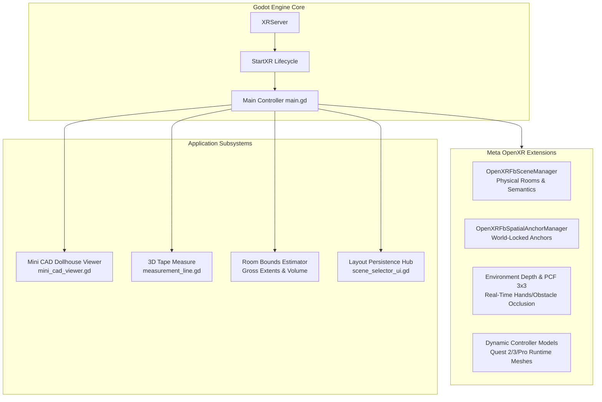

# Meta Scene XR Sample: Full Technical Analysis & Improvement Roadmap

---

## 1. Project Overview & Architecture

The **Meta Scene XR Sample** is an advanced mixed reality demonstration built on **Godot 4.3+** using the official **Godot OpenXR Vendors Plugin** (`godotopenxrvendors`). It targets Meta Quest 2, 3, and Pro headsets, focusing on physical-virtual integration:



---

## 2. Core Subsystems Review

### A. Meta Scene Understanding & Semantics
- **Mechanism**: [`OpenXRFbSceneManager`](file:///c:/Users/feljo/Desktop/Godot%20Projects%20XR/meta-scene-xr-sample/main.tscn#L104-L107) instantiates [`scene_anchor.tscn`](file:///c:/Users/feljo/Desktop/Godot%20Projects%20XR/meta-scene-xr-sample/scene_anchor.tscn) for each physical surface scanned via Meta Space Setup.
- **Classification**: Automatically assigns collision boundaries and color-coded materials based on semantic tags (`floor`, `ceiling`, `wall_face`, `couch`, `table`, `door_frame`, `window_frame`).
- **Global Wireframe Mesh**: In [`scene_global_mesh.gd`](file:///c:/Users/feljo/Desktop/Godot%20Projects%20XR/meta-scene-xr-sample/scene_global_mesh.gd#L23-L41), the raw triangle mesh indices are unrolled to supply unique barycentric coordinates for procedural polygon wireframe rendering.

### B. Spatial Anchors & Persistence
- **World Locking**: User-placed anchors snap to wall/floor normals or float freely in 3D space.
- **Cloud & Local Sync**: Anchors synchronize with Meta's local and cloud spatial anchor cache (`STORAGE_LOCAL` and `STORAGE_CLOUD`).
- **Multi-Layout Management**: [`main.gd`](file:///c:/Users/feljo/Desktop/Godot%20Projects%20XR/meta-scene-xr-sample/main.gd#L321-L446) implements multi-scene profiles saved at `user://saved_anchor_scenes.json` with safety guards to prevent premature overwrite during layout switching.

### C. 3D Tape Measure & Volumetric Estimator
- **Interactive Measurement**: Millimeter-accurate line calculation with dynamic orientation matrices, live pointer preview, and billboarded readouts with imperial/metric conversions ($L$, $\Delta X$, $\Delta Y$, $\Delta Z$).
- **Room Dimension Estimator**: Iterates over transformed AABBs and semantic labels to extract room height, width, length, floor area, and total room volume.

### D. Mini CAD / Dollhouse Prototype Viewer
- **Holographic Blueprint Workstation**: Renders a scaled miniature architectural model (1:10 to 1:100 scale) directly in front of the user.
- **Custom Shaders**:
  - Baseplate grid: [`assets/cad_blueprint_grid.gdshader`](file:///c:/Users/feljo/Desktop/Godot%20Projects%20XR/meta-scene-xr-sample/assets/cad_blueprint_grid.gdshader) with coordinate axes ($X, Z$) and major/minor grid lines.
  - Geometry surfaces: [`assets/cad_blueprint_surface.gdshader`](file:///c:/Users/feljo/Desktop/Godot%20Projects%20XR/meta-scene-xr-sample/assets/cad_blueprint_surface.gdshader) with camera-angle Fresnel glowing edges.
- **Viewing Modes**: 3D Isometric axonometric angle ($32^\circ, -45^\circ$), 2D Floorplan orthogonal plan view ($90^\circ$), and $360^\circ$ hands-free turntable orbit.

---

## 3. Critical Bugs & Logical Flaws Identified

During deep-dive code analysis, several functional and graphical bugs were uncovered:

### 🔴 1. Mini CAD Grab Handle Collision Layer Mask Mismatch
- **Location**: [`mini_cad_viewer.tscn:L54-L56`](file:///c:/Users/feljo/Desktop/Godot%20Projects%20XR/meta-scene-xr-sample/mini_cad_viewer.tscn#L54-L56) vs [`main.tscn:L99-L102`](file:///c:/Users/feljo/Desktop/Godot%20Projects%20XR/meta-scene-xr-sample/main.tscn#L99-L102)
- **Problem**:
  In `mini_cad_viewer.tscn`, `GrabHandle/Area3D` is set to **Layer 1** (`collision_layer = 1`).
  However, in `main.tscn`, `RightHandPointer/RayCast3D` is set to **Mask 6** (`collision_mask = 6`, which only detects Layer 2 and Layer 3).
- **Impact**: When the user aims the laser at the front grab bar and pulls the trigger, `right_hand_pointer_raycast.is_colliding()` ignores the handle completely. The workstation **cannot be grabbed or moved** with the pointer raycast!
- **Fix**: Move `GrabHandle/Area3D` to Layer 3 or include Layer 1 in the raycast mask (`collision_mask = 7`).

### 🔴 2. Inverted Material Assignment in Depth Occlusion Toggle
- **Location**: [`main.gd:L752-L757`](file:///c:/Users/feljo/Desktop/Godot%20Projects%20XR/meta-scene-xr-sample/main.gd#L752-L757)
- **Problem**:
  ```gdscript
  elif name == "by_button":
      global_environment_depth_enabled = not global_environment_depth_enabled
      environment_depth_node.visible = global_environment_depth_enabled
      depth_testing_mesh.set_surface_override_material(
          0, BLUE_MATERIAL if global_environment_depth_enabled else ENVIRONMENT_DEPTH_MATERIAL
      )
  ```
  `ENVIRONMENT_DEPTH_MATERIAL` is the custom shader that runs real-time environment depth occlusion. `BLUE_MATERIAL` is an unoccluded standard solid material.
- **Impact**: When environment depth is toggled **ON** (`global_environment_depth_enabled = true`), the test cube gets assigned `BLUE_MATERIAL` (no occlusion!). When toggled **OFF**, it gets assigned `ENVIRONMENT_DEPTH_MATERIAL`. The ternary is inverted.
- **Fix**: Swap the condition:
  ```gdscript
  depth_testing_mesh.set_surface_override_material(
      0, ENVIRONMENT_DEPTH_MATERIAL if global_environment_depth_enabled else BLUE_MATERIAL
  )
  ```

### 🟡 3. Baseplate Shader Grid Border Offset
- **Location**: [`assets/cad_blueprint_grid.gdshader:L44`](file:///c:/Users/feljo/Desktop/Godot%20Projects%20XR/meta-scene-xr-sample/assets/cad_blueprint_grid.gdshader#L44) vs [`mini_cad_viewer.tscn:L24`](file:///c:/Users/feljo/Desktop/Godot%20Projects%20XR/meta-scene-xr-sample/mini_cad_viewer.tscn#L24)
- **Problem**:
  The shader hardcodes `vec2 half_size = vec2(0.5, 0.5); // assumes 1x1 baseplate`.
  However, `mini_cad_viewer.tscn` sets the baseplate mesh size to `Vector3(1.2, 0.02, 1.2)` ($0.6 \times 0.6$ half extents).
- **Impact**: The glowing technical border is drawn 10 cm inside the edge of the mesh, resulting in negative distance clipping and visual seams along the perimeter.
- **Fix**: Pass `baseplate_half_size` as a uniform or calculate it dynamically from UVs.

### 🟡 4. Missing 3D Position in Layout Serialization (CAD Dollhouse Anchor Collapse)
- **Location**: [`main.gd:L395-L412`](file:///c:/Users/feljo/Desktop/Godot%20Projects%20XR/meta-scene-xr-sample/main.gd#L395-L412) & [`mini_cad_viewer.gd:L225-L234`](file:///c:/Users/feljo/Desktop/Godot%20Projects%20XR/meta-scene-xr-sample/mini_cad_viewer.gd#L225-L234)
- **Problem**:
  `save_current_layout()` only saves `entity.custom_data` (`{"color": ...}`) to disk because Meta's OpenXR driver tracks world coordinates behind the scenes. However, the $(x, y, z)$ position is never written to `user://saved_anchor_scenes.json`.
- **Impact**: When the Mini CAD Dollhouse previews a saved layout that is not currently loaded in the physical room, it executes `_spawn_mini_anchor(Vector3.ZERO, col, uuid)`. All anchors in inactive layouts stack on top of each other at $(0, 0, 0)$!
- **Fix**: Serialize each anchor's local/world transform vector into the JSON payload alongside `custom_data`.

### 🟡 5. Duplicate Signal Connections for Right Hand Controller
- **Location**: [`main.tscn:L125`](file:///c:/Users/feljo/Desktop/Godot%20Projects%20XR/meta-scene-xr-sample/main.tscn#L125) & [`main.gd:L72-L76`](file:///c:/Users/feljo/Desktop/Godot%20Projects%20XR/meta-scene-xr-sample/main.gd#L72-L76)
- **Problem**:
  Both `RightHand` (via scene signal connection) and `RightHandPointer` (via GDScript connect) listen for button presses and releases on `&"right_hand"`.
- **Impact**: Every button click triggers `_on_right_hand_button_pressed` and `_on_right_hand_button_released` twice. While trigger presses are debounced by 250ms, `button_released` has no gate and duplicates `end_grab()` and `_do_select(false)` calls.
- **Fix**: Connect button signals to `RightHandPointer` only.

### ⚪ 6. Left-Handed User Accessibility Barrier
- **Location**: [`main.gd:L598-L658`](file:///c:/Users/feljo/Desktop/Godot%20Projects%20XR/meta-scene-xr-sample/main.gd#L598-L658)
- **Problem**: The laser pointer, UI interaction, tape measure, CAD grab, and anchor placement are hardcoded exclusively to `RightHandPointer`. The left controller has no raycast node or pointer setup.
- **Fix**: Implement an ambidextrous pointer system or a "Dominant Hand" toggle in settings.

---

## 4. Architectural & Ergonomic Analysis

| Domain | Current State | Bottleneck / Deficiency | Recommended Evolution |
| :--- | :--- | :--- | :--- |
| **Haptic Feedback** | Non-existent | No tactile rumble on trigger click, UI hover, or anchor placement. | Add short haptic buzzes via `controller.trigger_haptic_pulse()` on hover, click, and grab. |
| **UI Ergonomics** | Floating static quad (1.2m away) | Spawns into walls or furniture; requires constant manual repositioning. | Implement a **Wrist-Mounted Watch / Tablet HUD** that stays attached to the left wrist and turns on when the palm faces the user. |
| **Tape Measure UX** | Single line, no edit/undo | Can only clear all measurements at once. No surface snapping indicator or angle measurement. | Add undo, individual measurement deletion, surface snapping reticle, and angle ($\theta$) calculation between two lines. |
| **Room Bounding Math** | Brute-force per-frame mesh traversal | Iterates all child mesh vertices when measuring or rebuilding CAD. | Cache calculated extents into a `RoomBounds` struct; only recompute when `openxr_fb_scene_capture_completed` or anchor changes occur. |
| **Anchor Semantics** | Random 8-color box | No custom naming, semantic icons, or 3D tags. | Allow users to type or voice-dictate anchor names, pick custom models (flags, pins, furniture placeholders), and attach virtual sticky notes. |
| **Hand Tracking** | Controllers only | Hand tracking plugin files exist in `addons/common`, but are not attached to `main.tscn`. | Support Quest Direct Touch and pinch gestures so users can interact without picking up controllers. |

---

## 5. Prioritized Improvement Plan

### Phase 1: Immediate Bug Fixes & Stability (Day 1)
1. **Fix CAD Grab Handle Collider**:
   Update `mini_cad_viewer.tscn` so `Area3D` has `collision_layer = 4` (Layer 3: Spatial Anchors) or adjust `RayCast3D.collision_mask = 7` to allow immediate grab interaction.
2. **Correct Depth Occlusion Material Inversion**:
   Fix the ternary logic in [`main.gd:L756`](file:///c:/Users/feljo/Desktop/Godot%20Projects%20XR/meta-scene-xr-sample/main.gd#L756).
3. **Fix Baseplate Shader Boundary**:
   Expose `uniform vec2 baseplate_half_size = vec2(0.6, 0.6)` in [`cad_blueprint_grid.gdshader`](file:///c:/Users/feljo/Desktop/Godot%20Projects%20XR/meta-scene-xr-sample/assets/cad_blueprint_grid.gdshader) to match the 1.2m mesh.
4. **Anchor Coordinate Serialization**:
   Save `{"color": ..., "position": [x, y, z], "rotation": [pitch, yaw, roll]}` in `saved_anchor_scenes.json` so the CAD dollhouse accurately renders inactive layouts.
5. **Clean Orphan Files**:
   Remove orphaned `test_scene_persistence.gd.uid` to eliminate Godot project loading warnings.

### Phase 2: Immersion & XR UX Enhancements (Week 1)
1. **Haptic Feedback Layer**:
   ```gdscript
   func trigger_haptic(controller: XRController3D, strength: float = 0.5, duration: float = 0.05) -> void:
       if controller:
           controller.trigger_haptic_pulse("haptic", 100.0, strength, duration, 0.0)
   ```
   Add subtle haptic feedback on UI button clicks (strength `0.2`), tape measure locks (strength `0.6`), and CAD workstation grabs (strength `0.8`).
2. **Wrist Watch / Palm Menu**:
   Attach a lightweight wrist HUD to `LeftHand` with tabs for Quick Actions (Passthrough, CAD, Tape, Settings) that automatically activates when looking at the left palm.
3. **Measurement Tool Upgrades**:
   - Surface normal reticle (shows perpendicular orientation on walls and floors).
   - "Undo Last" button and per-line deletion by pointing at the midpoint text badge.
   - Cumulative perimeter / multi-segment polygon calculation.

### Phase 3: Advanced Architecture & Meta Features (Week 2+)
1. **Meta Quest Direct Touch & Hand Tracking**:
   Integrate `addons/common/hand_pinch_detector` and `OpenXRHand3D` nodes so users can push floating buttons with their physical index fingers and pinch-drag the CAD model.
2. **Export & Sharing (CAD / Floorplan to GLTF / JSON)**:
   Add a button to export the measured room and CAD dollhouse geometry as a `.gltf` or `.obj` file to the headset's user folder (`user://export/room_layout.gltf`) for use in external CAD/BIM software (Blender, AutoCAD, Revit).
3. **Material Pooling in CAD Viewer**:
   In `mini_cad_viewer.gd`, instantiate shared static `ShaderMaterial` references for each semantic category (walls, floor, furniture) rather than duplicating materials per surface mesh, improving draw-call batching and GPU memory bandwidth on mobile XR2 hardware.

---

Would you like to proceed with implementing any of these improvements (such as the critical bug fixes for the CAD grab handle and depth material, or adding haptic feedback and wrist controls)?
