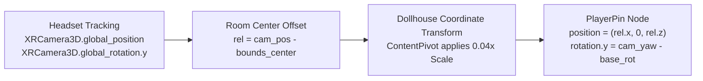

# Parametric 2.5D Room Reconstruction & Floating Dollhouse Diorama System

## 1. Executive Overview

This system provides a full architectural pipeline that transforms raw spatial room scans from Meta Quest hardware into a clean, parametric 3D architectural model and an interactive floating "Dollhouse" diorama with live player position tracking.

```
┌─────────────────────────────────────────────────────────────────────────────────┐
│                                SYSTEM PIPELINE                                  │
│                                                                                 │
│   Meta Scene Anchors           RoomDataManager             MiniCADViewer        │
│   [WALL, FLOOR, CEIL,  ────►  [OBB Calculation,   ────►   [Cutaway Extrusion,   │
│    FURNITURE, DOORS]           2D Ground Projection,       Frosted Shader,      │
│                                Yaw θ Alignment]            Live User Pin]       │
└─────────────────────────────────────────────────────────────────────────────────┘
```

The system replicates the native Meta Quest room capture review experience (shown in the room capture interface):
1. **Parametric 2.5D Extrusion**: Clean, orthogonal vertical walls extruded from floor elevation to ceiling height, replacing noisy raw scan triangles.
2. **Floating Miniature Dollhouse**: A chest-level, semi-transparent holographic miniature room with an open cutaway ceiling so users can inspect their space from an isometric or top-down perspective.
3. **Live User Locator Pin ("You Are Here")**: A radiant amber/orange avatar pawn standing inside the miniature room that mirrors the user's real-world headset position and viewing orientation in real time.
4. **Proxy Furniture Bounding Volumes**: Clean volumetric boxes representing detected beds, tables, couches, and storage units with crisp luminous edges.
5. **1:1 World-Space Blue Outlines**: Vibrant cyan/blue wireframe bounding boxes overlaid onto physical furniture and room openings in physical space.

---

## 2. Mathematical Principles & Formulations

### 2.1 2D Oriented Bounding Box (OBB) & Dominant Yaw Fitting

Standard Axis-Aligned Bounding Boxes (AABB) fail in mixed reality because physical rooms are almost never aligned with the Godot engine's global $(X, Z)$ coordinate axes (which depend on where the headset was booted). An AABB around an angled room causes severe distortion and oversized bounds.

The system calculates an **Oriented Bounding Box (OBB)** using normal-guided angular clustering and 2D ground projection.

#### Step 1: Horizontal Projection & Dominant Wall Angle
Given $N$ wall anchors where each wall $i$ has an inward-facing normal $\vec{n}_i = (n_{x, i}, n_{y, i}, n_{z, i})$:
1. Extract horizontal normal vector:
   $$\vec{u}_i = \frac{(n_{x, i}, n_{z, i})}{\|(n_{x, i}, n_{z, i})\|}$$
2. Compute planar wall angle:
   $$\phi_i = \text{atan2}(u_{z, i}, u_{x, i})$$
3. Under the **Manhattan World Assumption** (walls meet at $90^\circ$ increments), map each angle $\phi_i$ into the first quadrant $[0, \pi/2)$ via circular modulo:
   $$\phi_{\text{folded}, i} = \text{fposmod}\left(\phi_i, \; \frac{\pi}{2}\right)$$
4. Compute the dominant orientation angle $\theta$ using 4-harmonic circular averaging:
   $$\theta = \frac{1}{4} \text{atan2}\left( \sum_{i=1}^N \sin(4\phi_i), \; \sum_{i=1}^N \cos(4\phi_i) \right)$$

#### Step 2: Local Coordinate Rotation
With dominant angle $\theta$, rotate all transformed corner points $(x_k, z_k)$ into the room's local reference frame:
$$\begin{pmatrix} x'_k \\ z'_k \end{pmatrix} = \begin{pmatrix} \cos\theta & \sin\theta \\ -\sin\theta & \cos\theta \end{pmatrix} \begin{pmatrix} x_k \\ z_k \end{pmatrix}$$

#### Step 3: Extreme Bounds & Extrusion
Compute the local planar bounds:
$$x'_{\min} = \min_k(x'_k), \quad x'_{\max} = \max_k(x'_k)$$
$$z'_{\min} = \min_k(z'_k), \quad z'_{\max} = \max_k(z'_k)$$

The dimensions are:
$$\text{Width } W = x'_{\max} - x'_{\min}$$
$$\text{Length } L = z'_{\max} - z'_{\min}$$
$$\text{Height } H = y_{\text{ceiling}} - y_{\text{floor}}$$

#### Step 4: Un-Rotating Floor Corner Points
Un-rotate the 4 local 2D corners back to global 3D world space at floor elevation $y_{\text{floor}}$:
$$\begin{pmatrix} x_k \\ z_k \end{pmatrix} = \begin{pmatrix} \cos\theta & -\sin\theta \\ \sin\theta & \cos\theta \end{pmatrix} \begin{pmatrix} x'_k \\ z'_k \end{pmatrix}$$

$$\begin{aligned}
P_0 &= (x(x'_{\min}, z'_{\min}), \; y_{\text{floor}}, \; z(x'_{\min}, z'_{\min})) \\
P_1 &= (x(x'_{\max}, z'_{\min}), \; y_{\text{floor}}, \; z(x'_{\max}, z'_{\min})) \\
P_2 &= (x(x'_{\max}, z'_{\max}), \; y_{\text{floor}}, \; z(x'_{\max}, z'_{\max})) \\
P_3 &= (x(x'_{\min}, z'_{\max}), \; y_{\text{floor}}, \; z(x'_{\min}, z'_{\max}))
\end{aligned}$$

---

### 2.2 Live User Locator Pin ("You Are Here")

Inside the miniature dollhouse, the user's current physical position and viewing direction are rendered in real time.



#### Coordinate Mapping:
- Miniature room pivot is scaled by preset factor $S = 0.04$ ($1:25$ architectural scale).
- The player pin is parented under `ContentPivot` (which already applies scale $S$).
- Local Pin Position:
  $$\vec{P}_{\text{pin}} = \begin{pmatrix} x_{\text{camera}} - c_{x, \text{room}} \\ 0.0 \\ z_{\text{camera}} - c_{z, \text{room}} \end{pmatrix}$$
- Local Pin Yaw:
  $$\psi_{\text{pin}} = \psi_{\text{camera}} - \psi_{\text{model\_rotator}} - \psi_{\text{viewer}}$$

This guarantees that as the user walks across the real floor, the orange pawn moves proportionally across the miniature floor; as the user turns their head, the pawn's forward visor turns synchronously.

---

## 3. Shader Architecture

### 3.1 Frosted Holographic Shader (`assets/dollhouse_frosted.gdshader`)

Replicates the soft, translucent frosted-glass aesthetic seen in Meta Quest's spatial review mode:

```glsl
shader_type spatial;
render_mode blend_mix, depth_draw_opaque, cull_disabled;

uniform vec4 albedo_color : source_color = vec4(0.92, 0.95, 1.0, 0.32);
uniform vec4 edge_color : source_color = vec4(1.0, 1.0, 1.0, 0.95);
uniform float fresnel_power : hint_range(0.5, 8.0) = 2.0;
uniform float edge_intensity : hint_range(0.5, 5.0) = 2.2;
uniform float inner_glow : hint_range(0.0, 1.0) = 0.12;

void fragment() {
    // Two-sided fresnel: abs(dot(NORMAL, VIEW)) provides glowing silhouettes on both faces
    float cos_angle = abs(dot(normalize(NORMAL), normalize(VIEW)));
    float fresnel = pow(1.0 - clamp(cos_angle, 0.0, 1.0), fresnel_power);

    vec3 final_color = mix(albedo_color.rgb, edge_color.rgb, fresnel * 0.85);
    float final_alpha = clamp(albedo_color.a + fresnel * 0.65, 0.0, 1.0);

    ALBEDO = final_color;
    ALPHA = final_alpha;
    EMISSION = edge_color.rgb * (fresnel * edge_intensity + inner_glow);
}
```

**Key Characteristics**:
- `cull_disabled` allows interior and exterior faces to be viewed simultaneously in the cutaway.
- `abs(dot(normalize(NORMAL), normalize(VIEW)))` ensures edges glow cleanly whether viewed from inside or outside.
- Alpha blending prevents dark self-shadowing while preserving interior furniture visibility.

---

## 4. Component Structure & API Reference

### 4.1 `RoomDataManager` (Static Computational Engine)

| Method | Parameters | Returns | Description |
| :--- | :--- | :--- | :--- |
| `calculate_room_obb()` | `scene_manager: OpenXRFbSceneManager` | `Dictionary` | Calculates dominant yaw $\theta$, floor/ceiling elevations, width, length, height, and the 4 world-space floor corners. |
| `get_parametric_room_layout()` | `scene_manager: OpenXRFbSceneManager` | `Dictionary` | Aggregates the OBB, classified furniture items (`bed`, `couch`, `table`, etc.), openings (`door`, `window`), and wall anchors into a unified layout dictionary. |
| `get_floor_elevation()` | `spec: Dictionary` | `float` | Returns the measured floor elevation. |
| `get_ceiling_elevation()` | `spec: Dictionary` | `float` | Returns the measured ceiling elevation. |

### 4.2 `MiniCADViewer` (Floating Dollhouse Diorama)

| Method / Property | Type | Description |
| :--- | :--- | :--- |
| `dollhouse_mode` | `bool` | Toggles between clean floating Meta-style Dollhouse mode (default: `true`) and technical CAD grid mode. |
| `set_camera()` | `cam: XRCamera3D` | Registers the active VR camera for real-time user pin tracking. |
| `rebuild_cad_model()` | `preview_name: String` | Reconstructs procedural cutaway walls, furniture proxy boxes, and live user pin from current room scan data. |
| `set_scale_ratio()` | `new_ratio: float` | Smoothly tweens dollhouse scale (e.g. 1:10, 1:25, 1:50). |
| `start_grab() / end_grab()` | `controller: Node3D` | Smooth controller-anchored 6DoF repositioning of the floating miniature. |

### 4.3 `SceneAnchor` (1:1 World-Space Blue Outlines)

When semantic entities are generated by Meta's `OpenXRFbSceneManager`:
- Automatically calculates the bounding box extents (`mesh_instance.get_aabb()`).
- Instantiates an unshaded `WireframeBoundingBox` child with vibrant cyan/blue emission (`#00D9FF`).
- Displays 12 edge lines hugging physical furniture and opening frames in 1:1 scale, exactly matching Meta Quest's spatial capture review mode.

---

## 5. In-Headset Verification & Ergonomics

1. **Floating Position**:
   Spawned 0.95m directly in front of the user at chest level ($Y = Y_{\text{cam}} - 0.35\text{m}$), tilted facing the user so they can comfortably glance down into the dollhouse without neck strain.
2. **Direct Interaction**:
   The entire dollhouse bounding volume is equipped with an interaction `Area3D`. Aiming any controller pointer or hand-ray at the floating room and holding trigger immediately grabs and repositions the model.
3. **Cutaway Wall Height**:
   Walls are extruded to 85% of total ceiling height with the ceiling removed, ensuring the interior room layout and furniture proxies are completely visible from all viewing angles.
