# Systems & Subsystems Analysis

This document provides a detailed technical breakdown of the four core application subsystems implemented in the project:
1. **Interactive 3D Measurement System**
2. **Room Dimension & Volumetric Estimator**
3. **Multi-Layout Anchor Persistence Hub**
4. **Adaptive Raycast & Pointer Interaction System**

---

## 1. Interactive 3D Measurement System

The measurement system enables millimeter-accurate point-to-point distance measurement in mixed reality, utilizing physical room surfaces or free space.

### Component Structure
- **Script**: [`measurement_line.gd`](file:///c:/Users/feljo/Desktop/Godot%20Projects%20XR/meta-scene-xr-sample/measurement_line.gd)
- **Scene**: [`measurement_line.tscn`](file:///c:/Users/feljo/Desktop/Godot%20Projects%20XR/meta-scene-xr-sample/measurement_line.tscn)
- **Visual Nodes**:
  - `StartSphere` (`MeshInstance3D`, Cyan glow sphere at Point A)
  - `EndSphere` (`MeshInstance3D`, Cyan glow sphere at Point B)
  - `CylinderLine` (`MeshInstance3D`, Dynamic connecting cylinder)
  - `Label3D` (Billboarded text hovering over midpoint)

### Vector Math & Mesh Alignment
When updating points (`update_points(p_a, p_b)`):
1. **Midpoint & Distance**:
   $$\vec{D} = P_B - P_A, \quad L = \|\vec{D}\|, \quad P_{mid} = \frac{P_A + P_B}{2}$$
2. **Orientation Matrix Construction**:
   To align Godot's standard cylinder along $\vec{D}$ (the local Y axis):
   ```gdscript
   var dir = diff.normalized()
   var up_vec = Vector3.UP if absf(dir.dot(Vector3.UP)) < 0.99 else Vector3.RIGHT
   var x_vec = dir.cross(up_vec).normalized()
   var z_vec = x_vec.cross(dir).normalized()
   cylinder_mesh_instance.global_transform = Transform3D(Basis(x_vec, dir, z_vec), mid_point)
   cylinder_mesh_instance.mesh.height = dist
   ```
3. **Axis-Aligned Delta Breakdown**:
   In addition to Euclidean distance $L$, the system extracts coordinate deltas:
   $$\Delta X = |P_{B,x} - P_{A,x}|, \quad \Delta Y = |P_{B,y} - P_{A,y}|, \quad \Delta Z = |P_{B,z} - P_{A,z}|$$
   Display format: `3.42 m [W: 2.10m | L: 2.65m | H: 0.45m]`

### Interaction States

```mermaid
stateDiagram-v2
    [*] --> Idle: Tape Measure Inactive
    Idle --> SettingPointA: Toggle "Start Tape Measure"
    SettingPointA --> SettingPointB: Aim at surface & Pull Trigger (Set Point A)
    SettingPointB --> SettingPointB: Real-time preview updates in _physics_process
    SettingPointB --> Placed: Pull Trigger (Set Point B)
    Placed --> SettingPointA: Measurement pinned; ready for next segment
    Placed --> Idle: Click "Stop Tape Measure"
    Placed --> Idle: Click "Clear Measurements"
```


---

## 2. Room Dimension & Volumetric Estimator

The room bounding system automatically calculates the gross dimensions of the scanned physical room using geometry extracted by Meta Space Setup.

### Algorithm Breakdown (`main.gd` -> `calculate_room_dimensions()`)
1. **Semantic Boundary Identification**:
   Iterates through all `Node3D` children of `OpenXRFbSceneManager`. If a child's label contains `"floor"` or `"ceiling"`, its position directly seeds the vertical extents:
   ```gdscript
   if "floor" in lbl_text:
       found_floor = true
       floor_y = minf(floor_y, pos.y)
   elif "ceiling" in lbl_text:
       found_ceiling = true
       ceiling_y = maxf(ceiling_y, pos.y)
   ```
2. **Global Mesh AABB Accumulation**:
   For each surface mesh, extracts its local `AABB` and transforms all 8 corner vertices into world coordinates:
   $$V_{world, i} = T_{global} \times V_{local, i}, \quad i \in [0..7]$$
   Tracks global extrema: $[X_{min}, X_{max}]$, $[Y_{min}, Y_{max}]$, $[Z_{min}, Z_{max}]$.
3. **Collision Shape Fallback**:
   If no `MeshInstance3D` is attached to a surface node, the algorithm inspects `CollisionShape3D` (`BoxShape3D`), transforming its half-extents into world space.
4. **Metrics Derivation**:
   $$\text{Height} = \begin{cases} Y_{ceiling} - Y_{floor} & \text{if both detected} \\ Y_{max} - Y_{min} & \text{otherwise} \end{cases}$$
   $$\text{Width} = X_{max} - X_{min}, \quad \text{Length} = Z_{max} - Z_{min}$$
   $$\text{Floor Area} = \text{Width} \times \text{Length}, \quad \text{Volume} = \text{Floor Area} \times \text{Height}$$

---

## 3. Multi-Layout Anchor Persistence Hub

The layout persistence system allows users to store, switch, and delete complete configurations of world-locked spatial anchors under custom or preset names.

### Data Schema (`user://saved_anchor_scenes.json`)
```json
{
  "current_scene": "Living Room",
  "scenes": {
    "Living Room": {
      "updated_at": "2026-09-08T11:20:00",
      "anchors": {
        "12345678-1234-1234-1234-123456789abc": {
          "color": "#00FFFF"
        },
        "87654321-4321-4321-4321-cba987654321": {
          "color": "#FF8000"
        }
      }
    },
    "Office": {
      "updated_at": "2026-09-08T10:15:30",
      "anchors": {}
    }
  }
}
```

### Safety Features
- **Legacy Migration**: If `saved_anchor_scenes.json` is missing, the system checks for the legacy single-layout file `user://openxr_fb_spatial_anchors.json` and automatically migrates it into a `"Default"` scene entry.
- **Layout Switch Guard (`_is_switching_layout`)**: When unloading anchors during a scene transition, an internal boolean flag prevents premature auto-save triggers from erasing anchor data from disk while untracking nodes.

---

## 4. Adaptive Raycast & Pointer Interaction System

User interaction in the 3D world is handled via `RightHandPointer` and the 2D-in-3D UI subsystem.

```mermaid
flowchart TD
    Ray[RayCast3D Target: -10m] --> CheckMenu{Intersects Floating Menu?}
    CheckMenu -- Yes --> HoverUI[Forward Laser to Viewport2D]
    HoverUI --> ClickMenu{Trigger Pressed?}
    ClickMenu -- Yes --> DispUI[FunctionPointer._do_select(true)]
    
    CheckMenu -- No --> CheckTape{Tape Measure Active?}
    CheckTape -- Yes --> TapeLogic[Place Point A or Complete Point B]
    CheckTape -- No --> CheckWorld{Collides with Layer 2 or 3?}
    CheckWorld -- Layer 3 (Anchor) --> SelAnchor[Highlight Selected Anchor]
    SelAnchor --> ClickDel{Trigger Pressed?}
    ClickDel -- Yes --> Untrack[Untrack Anchor & Update Disk]
    
    CheckWorld -- Layer 2 (Room) --> CollideDot[Show Cyan Collision Dot]
    CollideDot --> ClickCreate{Trigger Pressed?}
    ClickCreate -- Yes --> CreateAnchor[Create Normal-Aligned Spatial Anchor]
```

### Key Technical Mechanisms
1. **Dynamic Beam Scaling**:
   ```gdscript
   var pointer_length: float = (collision_point - right_hand_pointer.global_position).length()
   scene_pointer_mesh.mesh.size.z = pointer_length
   scene_pointer_mesh.position.z = -pointer_length / 2.0
   ```
   If no surface is hit, the beam defaults to a 5-meter resting length.
2. **Trigger Debouncing**:
   A 250ms software gate (`_last_trigger_press_msec`) prevents accidental double-placements from quick controller clicks.
3. **Menu Ray Intersection**:
   Calls `scene_menu_viewport.intersects_ray()` before testing world colliders. If aiming at the floating window, world collision markers are hidden and input events are routed directly to `FunctionPointer`.
